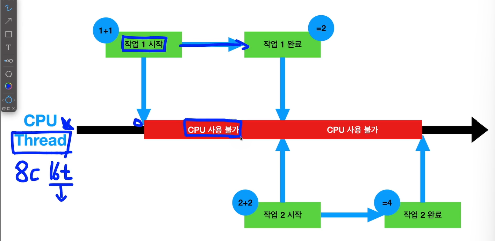
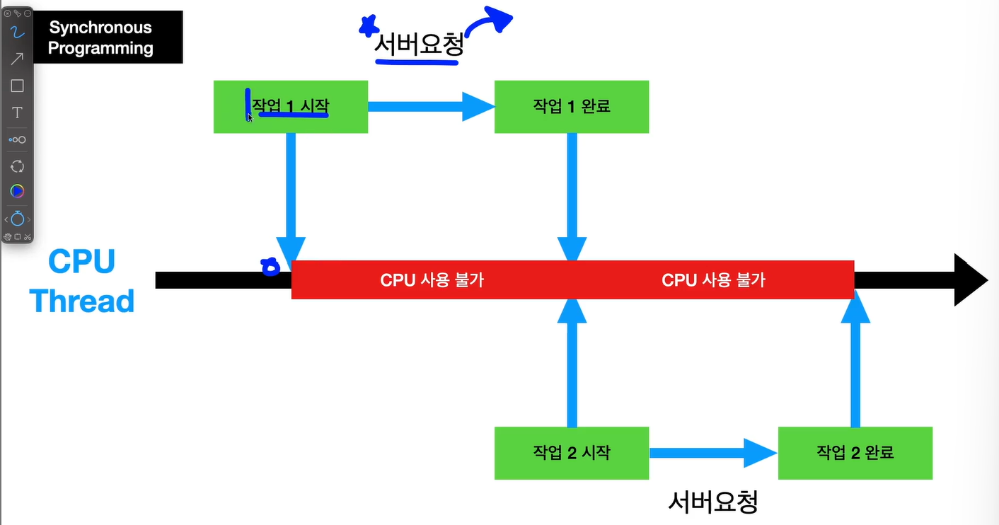
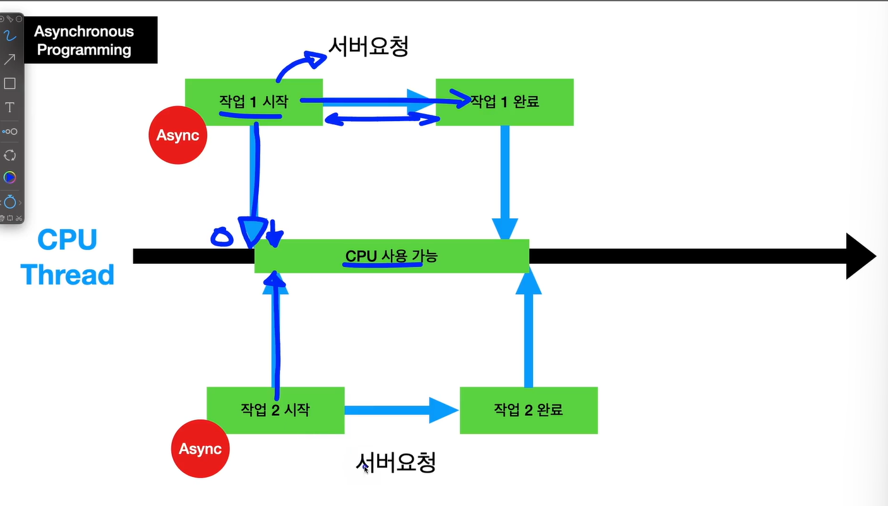

Thread: 작업을 하는 가장 작은 유닛

하나의 작업을 끝나야지 다른 작업을 시작할 수 있음 (평소에는 문제 없음)

-> 서버 요청이 들어가는 순간 문제가 생김

Asynchronous Programming (비동기 프로그래밍)

서버 요청을 날리면, 다시 CPU가 풀려버려서 다른 작업을 실행할 수 있음

-> CPU를 좀 더 효율적으로 쓸 수 있고 낭비 시간을 줄일 수 있음
